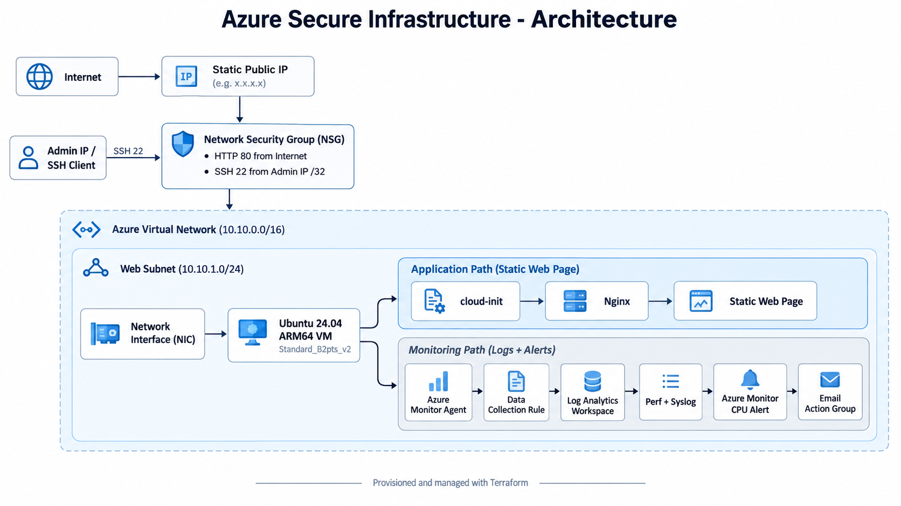
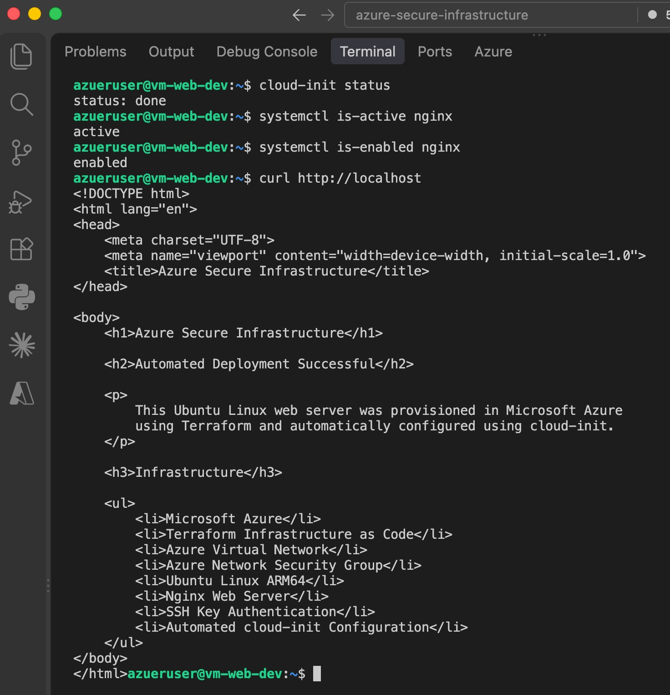
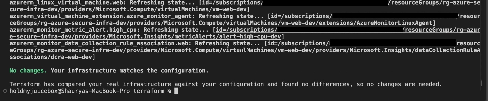

# Azure Secure Infrastructure with Terraform

A portfolio project that provisions, secures, configures, and monitors a Linux web server on **Microsoft Azure** using **Terraform**.

The project was built to demonstrate practical Junior Cloud Engineer skills: Infrastructure as Code, Azure networking, Linux administration, secure SSH access, automated VM bootstrapping, observability, and alerting.

## Architecture



## What This Project Demonstrates

- **Infrastructure as Code:** Azure resources are provisioned and managed with Terraform.
- **Azure networking:** Virtual Network, subnet, Network Security Group, static Public IP, and network interface.
- **Linux administration:** Ubuntu Linux, SSH key authentication, systemd, Nginx, package management, logs, and basic troubleshooting.
- **Automated configuration:** `cloud-init` installs and configures Nginx automatically when the VM is provisioned.
- **Security:** Password authentication is disabled, SSH is restricted to the administrator IP, and the VM uses a system-assigned Managed Identity.
- **Observability:** Azure Monitor Agent sends performance counters and Linux Syslog data to Log Analytics through a Data Collection Rule.
- **Monitoring and alerting:** Azure Monitor tracks VM CPU and uses an Action Group for email notifications when the configured CPU threshold is exceeded.
- **Cost awareness:** The environment uses a small burstable VM and can be destroyed with Terraform when it is no longer needed.

## Azure Resources

The Terraform configuration provisions the following resources:

| Resource | Purpose |
|---|---|
| Resource Group | Logical container for the project |
| Virtual Network | Private Azure network (`10.10.0.0/16`) |
| Web Subnet | VM subnet (`10.10.1.0/24`) |
| Network Security Group | Controls inbound network traffic |
| Static Public IP | Provides external connectivity to the web server |
| Network Interface | Connects the VM to the subnet and Public IP |
| Ubuntu Linux VM | Hosts the Nginx web server |
| System-Assigned Managed Identity | Gives the VM an Azure-managed identity without stored credentials |
| Log Analytics Workspace | Stores collected VM telemetry |
| Azure Monitor Agent | Collects guest operating-system telemetry |
| Data Collection Rule | Defines performance and Syslog data collection |
| Azure Monitor Metric Alert | Detects high CPU utilization |
| Action Group | Sends alert notifications by email |

## Security Configuration

The project uses several security controls:

- SSH password authentication is disabled.
- SSH uses an **ED25519 key pair**.
- TCP port **22** is restricted to the administrator's public IP using `/32`.
- TCP port **80** is opened only for the Nginx web service.
- Azure credentials are not stored in the Terraform files.
- `terraform.tfvars`, Terraform state, and `.terraform/` are excluded from Git.
- A **system-assigned Managed Identity** is enabled on the VM.
- The project uses NSG rules rather than exposing unrestricted administrative access.

> **Important:** Terraform state can contain infrastructure metadata and configuration values. Do not commit `terraform.tfstate`, `terraform.tfstate.*`, or `terraform.tfvars` to a public repository.

## Project Structure

```text
azure-secure-infrastructure/
├── terraform/
│   ├── versions.tf
│   ├── providers.tf
│   ├── variables.tf
│   ├── main.tf
│   ├── network.tf
│   ├── compute.tf
│   ├── monitoring.tf
│   ├── alerts.tf
│   └── outputs.tf
├── scripts/
│   └── cloud-init.yaml
├── web/
│   └── index.html
├── docs/
│   └── screenshots/
│       ├── cloud-init-nginx-validation.jpg
│       └── terraform-final-state.jpg
├── .gitignore
└── README.md
```

## Prerequisites

Before deploying the project, install:

- [Terraform](https://developer.hashicorp.com/terraform/install)
- [Azure CLI](https://learn.microsoft.com/cli/azure/install-azure-cli)
- Git
- An Azure subscription
- An SSH key pair

The project was built with Terraform `1.16.x`.

## Authentication

Sign in to Azure:

```bash
az login
```

Check the active subscription:

```bash
az account show --output table
```

## Local Variables

Create a local file:

```text
terraform/terraform.tfvars
```

Example:

```hcl
subscription_id = "YOUR-AZURE-SUBSCRIPTION-ID"
admin_ip_cidr   = "YOUR-PUBLIC-IP/32"
alert_email     = "YOUR-EMAIL@example.com"
```

`terraform.tfvars` must remain excluded from Git.

To find your current public IPv4 address:

```bash
curl -4 https://api.ipify.org
```

## Deploy the Infrastructure

Enter the Terraform directory:

```bash
cd terraform
```

Initialize Terraform:

```bash
terraform init
```

Format the configuration:

```bash
terraform fmt
```

Validate the configuration:

```bash
terraform validate
```

Review the deployment plan:

```bash
terraform plan
```

Deploy:

```bash
terraform apply
```

Type `yes` when Terraform asks for confirmation.

## Verify the Deployment

Show the Terraform outputs:

```bash
terraform output
```

Test the public web server:

```bash
curl http://$(terraform output -raw vm_public_ip)
```

Connect to the VM:

```bash
ssh -i ~/.ssh/azure_secure_infra \
  azureuser@$(terraform output -raw vm_public_ip)
```

Inside the VM, verify automated configuration:

```bash
cloud-init status
systemctl is-active nginx
systemctl is-enabled nginx
curl http://localhost
```

Expected status:

```text
status: done
active
enabled
```

## Monitoring

The project uses:

- Azure Monitor Agent
- Log Analytics Workspace
- Data Collection Rule
- Linux Syslog
- CPU, memory, and disk performance counters

Verify the Azure Monitor Agent from your local machine:

```bash
az vm extension show \
  --resource-group rg-azure-secure-infra-dev \
  --vm-name vm-web-dev \
  --name AzureMonitorLinuxAgent \
  --query provisioningState \
  --output tsv
```

Expected result:

```text
Succeeded
```

### Example KQL Query

In the Log Analytics Workspace, the following query returns recent Linux Syslog messages:

```kusto
Syslog
| where TimeGenerated > ago(30m)
| order by TimeGenerated desc
```

Example performance query:

```kusto
Perf
| where TimeGenerated > ago(30m)
| summarize by ObjectName, CounterName
| order by ObjectName asc
```

## Azure Monitor Alert

A Terraform-managed Azure Monitor metric alert monitors the VM's **Percentage CPU** metric.

Configuration:

```text
Metric:       Percentage CPU
Aggregation:  Average
Threshold:    > 80%
Window:       5 minutes
Evaluation:   Every 1 minute
Action:       Email notification through Azure Monitor Action Group
```

## Screenshots

### Automated Linux Provisioning

The VM completes `cloud-init`, Nginx starts automatically, and the generated page is served locally.



### Terraform Final State

The final Terraform validation confirms that the deployed Azure infrastructure matches the configuration with no detected drift.



## Useful Terraform Commands

```bash
terraform fmt
terraform validate
terraform plan
terraform apply
terraform output
terraform destroy
```

Before running `terraform apply`, always review the plan.

## Clean Up

Azure resources can continue to incur charges while they exist.

When the environment is no longer needed:

```bash
terraform destroy
```

Review the plan and type:

```text
yes
```

This removes the resources managed by Terraform.

## Skills Practised

This project provided hands-on experience with:

- Microsoft Azure
- Terraform
- Infrastructure as Code
- Azure Virtual Network and subnetting
- CIDR addressing
- Network Security Groups
- Azure Linux Virtual Machines
- SSH key authentication
- Ubuntu Linux administration
- Nginx
- cloud-init
- Managed Identity
- Azure Monitor
- Azure Monitor Agent
- Log Analytics
- Data Collection Rules
- KQL
- Azure Monitor metric alerts
- Action Groups
- Azure CLI
- Git and GitHub
- Cloud security fundamentals
- Infrastructure troubleshooting

## Future Improvements

The current version is intentionally scoped as a beginner-friendly infrastructure project. Useful next improvements would be:

1. Store Terraform state remotely in an **Azure Storage Account** with state locking and versioning.
2. Add **GitHub Actions** for `terraform fmt`, `validate`, and `plan` on pull requests.
3. Add **HTTPS** using a domain name and TLS certificate.
4. Replace direct public VM administration with **Azure Bastion** or another private-access design.
5. Add a **Load Balancer** and multiple VMs or a Virtual Machine Scale Set for high availability.
6. Store application secrets in **Azure Key Vault**.
7. Containerize the web application with **Docker** and deploy through Azure Container Registry.
8. Add additional operational alerts for VM availability, disk usage, and failed SSH attempts.

